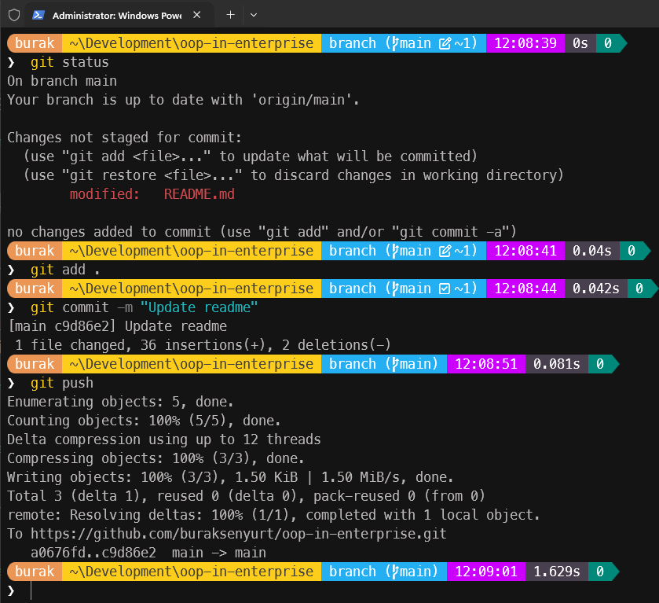
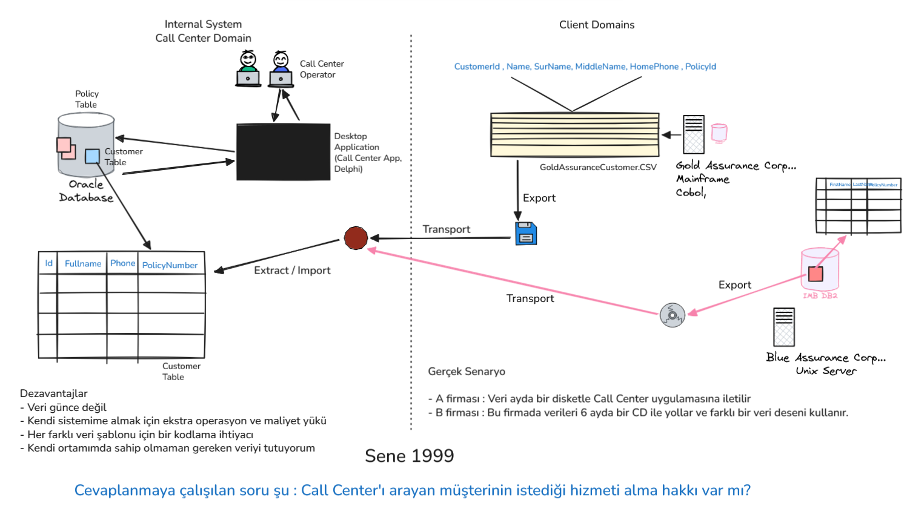

# oop-in-enterprise

Sektör kampüste projesi kapsamında açtığımız **"Kurumsal Yazılım Çözümlerinden OOP ile Çalışmak"** dersine ait notların, örnek kodların yer aldığı repodur.

## Önsöz

Bu derste amacımız kurumsal yazılım çözümlerinde OOP'nin nasıl kullanıldığına dair temel bir anlayış kazanmaktır. OOP'nin temel prensiplerini ve bu prensiplerin kurumsal yazılım geliştirme süreçlerinde nasıl uygulandığını öğreneceğiz. Ayrıca, OOP'nin avantajlarını ve dezavantajlarını tartışarak, gerçek dünya senaryolarında nasıl etkili bir şekilde kullanılabileceğini göreceğiz. Uçtan uca bir proje üzerinden ilerlerken, dağıtık sistemlere, domain driven design (DDD) ve microservices mimarisi gibi kavramlara da değineceğiz.

Vize ve final sınavlarına hazırlanmak için aşağıdaki quizleri çözebilirsiniz.

- [Quiz 00](./exams/quiz00.md)
- [Quiz 01](./exams/quiz01.md)

## Referanslar

- C# Programlama dili ile ilgili temel kavramlar için [ProgrammingWithCSharp](https://github.com/buraksenyurt/ProgrammingWithCSharp) reposunu inceleyebilirsiniz.

## Gereksinimler

Müfredat boyunca bize gereken araçlar ve ortamlar;

- DotNet 8 veya üstü SDK [Download için](https://dotnet.microsoft.com/en-us/download)
- *Visual Studio Code* veya *Visual Studio* ya da kendinizi rahat hissettiğiniz herhangi bir IDE
- [Git](https://git-scm.com/install/) ve GitHub hesabı

## Gün 00

Bugün kullandığımız komut satırı ifadeleri şöyledir.

```bash
# Repoyu lokal bilgisayar klonlamak için
git clone https://github.com/buraksenyurt/oop-in-enterprise.git

# Makinedeki git komutlarını öğrenmek için
git --help

# Değişiklikleri görmek için
git status

# Değişiklikleri stage'e almak için
git add .

# Değişiklikleri local makinede commit etmek için
git commit -m "commit mesajı"

# Değişiklikleri repoya göndermek için
git push origin main

# Repodaki son değişiklikleri çekmek için
git pull origin main
```



Dotnet tarafında kullandığımız komutlar ise şöyle.

```bash
# Makinede yüklü dotnet sürümünü öğrenmek için
dotnet --version

# Dotnet ile ne tür projeler geliştirebiliriz
dotnet new list

# Yeni bir console projesini dotnet komut satırından çalıştırdık
dotnet new console -o HelloWorld

# Programımızı çalıştırmak için
dotnet run
```

Bu ilk dersimize ait bazı önemli noktaları aşağıdaki gibi özetleyebiliriz.

- Github üzerinde Repository oluşturma
- Temel **markdown** komutları
- **Source Control** aracı olarak **git** CLI aracını kullandık.
- Kurumsal yazılım çözümlerinde standartlar önemlidir ve bunu sağlamanın birçok yolu var. Birisi de **Code Review** süreçlerini işletmektir. *(Anahtar kelimeler: Code Review, Pull Request, Merge Request)*
- Belli bir domain'e özgü veri yapısı tasarlarken ilk adımlar

## Gün 01

İkinci dersimizde yeni bir sınıf kütüphanesi oluşturup kısaca birbirleriyle ilişkili *business object*'lerin tasarımına değindik. Deneysel olarak insan kaynakları domain'ine ait *Candidate*, *Graduate*, *ContactInformation* gibi sınıflar tasarlamaya başladık. Anafikir olarak gerçek dünya iş problemlerini modelleyebileceğimiz tutarlı ve anlaşılır bir domain tasarımı üzerinde durmaya çalıştık. Üzerinde durduğumuz temel kullanımları şöyle özetleyebiliriz;

- Yeni bir dotnet solution oluşturulması
- Yeni bir proje oluşturulması (Örneğin bir class library) ve solution'a eklenmesi
- Basit entity sınıf tasarımı
- Basit enum türü kullanımı
- Primitive tipler; string, GUID, short, float, bool
- Kompleks tip kullanımı; `List<T>`

Bu derste kullandığımız komut satırı ifadeleri.

```bash
# Yeni bir dotnet solution oluşturulması
dotnet new sln -n HumanResources

# Yeni bir proje oluşturulması (Örneğin bir class library)
dotnet new classlib -o HumanResources.Domain

# Projeyi var olan bir Solution'a eklemek
dotnet sln add HumanResources.Domain/HumanResources.Domain.csproj

# Tüm Solution'ın derlenmesi
dotnet build
```

## Gün 02

Bu derste aşağıdaki konu başlıklarını ele aldığımız örnekler üzerinde çalıştık.

- Sadece alanlardan *(fields)* oluşan sınıf tasarımı.
- *Enum* veri türü kullanımı.
- Bir sınıftan nesne örneği oluşturmak için farklı yollar. *(Constructor kullanmadan)*
- Nesne örnek dizileri oluşturmak ve kullanmak.
- İleri yönlü iterasyonlar için *foreach* döngüsü kullanımı.
- Nesne metotları ve bu metotların nesne örnekleri üzerinden çağrılması.
- *Static* sınıflar ve metotların kullanımı.
- *Higher order functions* kavramına giriş niteliğinde Where, ForEach gibi metotların örnek kullanımı.
- Visual Studio ortamında temel *Debug* işlemleri *(Step into, Step over)* ve nesnelerin anlık durumlarının izlenmesi.

[Örnek kod dosyası](src/Fundamentals/ObjectInstances.cs)

## Gün 03

Önceki dersteki konuların tekrarını takiben geçmiş yıllara dönüp **CSV** formatında veri içeren müşteri verilerinin bir çağrı merkezi sistemine alınması üzerine aşağıdaki diagramdaki akışı değerlendirdik.



Ayrıca aşağıdaki konu başlıklaırını ele aldık.

- Constructor overloading kavramı ve kullanımı
- Property'ler de private set kullanımı
- Temel seviyede *encapsulation* kavramı ve uygulaması
- *Exception* yapısı ve *try-catch* blokları ile hata yönetimi
- *Exception* yapısında *throw* ifadesi ile hata fırlatma
- *Rich Entity* kavramı ve basit örnek üzerinden incelenmesi
- *Debug* işlemleri ve *breakpoint* kullanımı

[Örnek kod dosyası](src/Fundamentals/ObjectInstances2.cs)
